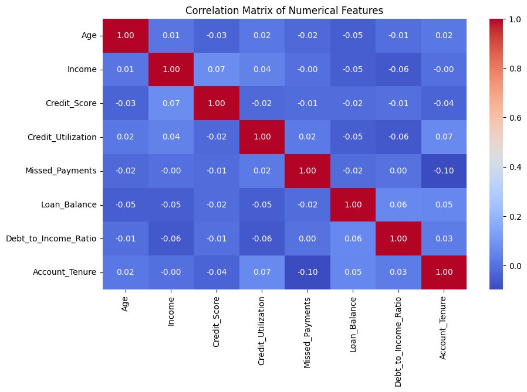
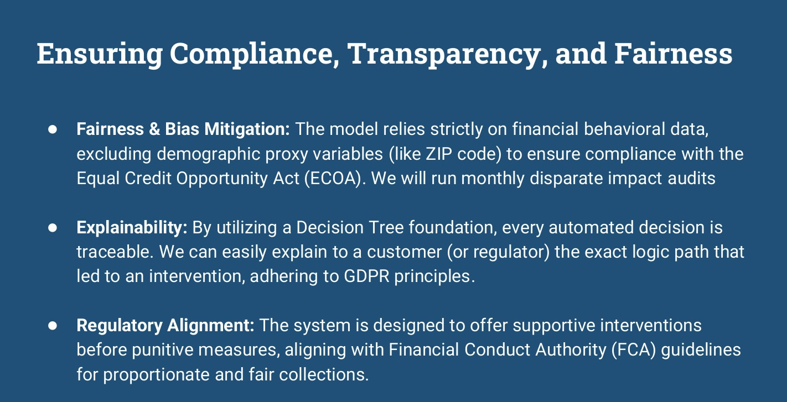

# Tata iQ GenAI Data Analytics Project

## Project Overview

This project demonstrates an end-to-end data science workflow for **credit risk analysis and AI-driven collections strategy**.
It combines **Exploratory Data Analysis, Predictive Modeling, and Responsible AI strategy design** to help financial institutions proactively identify and assist high-risk customers.

---

## Project Structure

```
Tata-iQ-GenAI-Data-Analytics
│
├── Task-1-EDA
│   └── EDA_Credit_Risk_Analysis.ipynb
│
├── Task-2-Model-Architecture
│   └── Predictive_Model_Decision_Tree.ipynb
│
├── Task-3-Data-Storytelling
│   └── Geldium_Business_Summary_Report.pdf
│
└── Task-4-AI-Collections-Strategy
    └── Tata_iQ_Agentic_AI_Strategy_Deck.pdf
```

---

## Key Skills & Technologies

**Data Science & Machine Learning**

* Exploratory Data Analysis (EDA)
* Predictive Modeling
* Decision Trees
* Feature Engineering

**Programming & Tools**

* Python
* Pandas
* Matplotlib
* Seaborn
* Jupyter Notebook

**Business & Strategy**

* Data Storytelling
* KPI Tracking
* SMART Goal Framework
* Cross-functional Communication

**Responsible AI**

* Agentic AI Systems
* Bias Mitigation
* Explainable AI (XAI)
* Regulatory Compliance (ECOA, GDPR, FCA)

---

## Project Breakdown

### Task 1 – Exploratory Data Analysis

**Objective:**
Identify patterns in customer repayment behavior and detect risk indicators.

**Actions**

* Cleaned and analyzed historical credit customer data
* Built correlation and behavioral analysis visualizations

**Key Insight**

Traditional financial metrics such as **income alone showed very weak correlation with default risk**.
Instead, behavioral indicators like payment history and credit utilization were more predictive.

---

### Task 2 – Predictive Modeling (Decision Tree)

**Objective:**
Design an interpretable machine learning model to predict credit card delinquency.

**Actions**

* Implemented a **Decision Tree model** for high explainability
* Analyzed feature importance for delinquency prediction

**Key Insight**

The strongest predictor of default risk was:

High Credit Utilization (>70%)
+
Multiple consecutive missed payments

---

### Task 3 – Business Strategy & Data Storytelling

**Objective:**
Translate technical model insights into actionable business strategies.

**Actions**

* Created a **2-page executive report**
* Communicated findings to non-technical stakeholders

**Recommendation**

Shift from **reactive collections** to **proactive financial coaching and debt restructuring** using a SMART framework.

---

### Task 4 – AI-Powered Collections Strategy

**Objective:**
Design an **Agentic AI system** for automated and intelligent customer outreach.

**Key Features**

**Continuous Learning**

* Adjusts outreach frequency based on customer response patterns

**Dynamic Intervention**

* Automated SMS for low-risk cases
* Human-in-the-loop oversight for complex cases

**Responsible AI Guardrails**

* Fairness monitoring
* Model explainability
* Regulatory compliance

---

## Business Impact

Implementing this AI-driven strategy could potentially:

* Reduce **30-day delinquency rates by ~12%**
* Improve operational efficiency for collections teams
* Strengthen long-term customer relationships

---






## Author

**Suryakant Prajapati**
B.Tech CSE (AI & Data Science)

GitHub Portfolio Project
